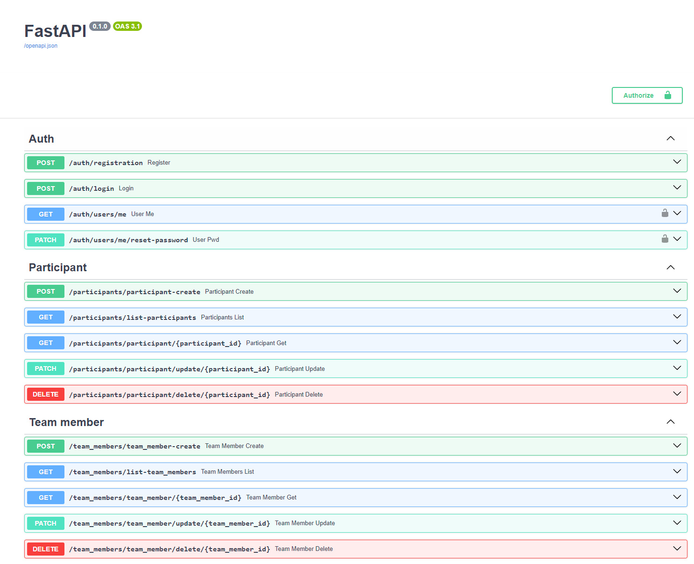

# Лабораторная раб. 1

Научиться реализовывать полноценное серверное приложение с помощью фреймворка FastAPI с применением дополнительных средств и библиотек. 
Задача состоит в разработке программной системы, которая будет использоваться для организации и проведения хакатонов. Хакатон - это соревнование, на котором участники, как правило, программисты, дизайнеры и бизнес-специалисты, работают над проектами в течение определенного времени, решая поставленные задачи или разрабатывая новые идеи. Система должна предоставлять следующий функционал:

* Регистрация участников: Участники должны иметь возможность зарегистрироваться на хакатон, указав свои данные (имя, адрес электронной почты, контактный номер и т. д.). После регистрации участники должны получить подтверждение от организаторов.

* Формирование команд: Участники должны иметь возможность создавать команды или присоединяться к уже существующим. Команды могут состоять из участников с различными навыками (программирование, дизайн, маркетинг и т. д.).

* Публикация задач: Организаторы хакатона должны иметь возможность публиковать задачи или проекты, над которыми будут работать участники. Каждая задача должна содержать описание, требования и критерии оценки.

* Оценка работ: Участники должны иметь возможность загружать свои работы и прототипы для оценки.

## Ход выполнения работы

### main.py
```
from fastapi import FastAPI
import uvicorn
from database import init_db
from routers.task_router import router as tasks_router
from routers.participant_router import router as participant_router
from routers.submission_router import router as submission_router
from routers.team_member_router import router as team_member_router
from routers.team_router import router as team_router
from routers.auth_router import router as auth_router

app = FastAPI()

app.include_router(auth_router, prefix="/auth")
app.include_router(participant_router, prefix="/participants")
app.include_router(team_member_router, prefix="/team_members")
app.include_router(team_router, prefix="/teams")
app.include_router(tasks_router, prefix="/tasks")
app.include_router(submission_router, prefix="/submissions")

@app.on_event("startup")
def on_startup():
    init_db()
```

### database.py
```
from sqlmodel import SQLModel, Session, create_engine
import os
from dotenv import load_dotenv

load_dotenv()
db_url = os.getenv('DB_ADMIN')
engine = create_engine(db_url, echo=True)


def init_db():
    SQLModel.metadata.create_all(engine)


def get_session():
    with Session(engine) as session:
        yield session
```

## Роутеры
### auth_router.py
```
import datetime
from fastapi import APIRouter, HTTPException, Depends, status, Security
from fastapi.security import HTTPBearer, HTTPAuthorizationCredentials
from schemas import Participant, ParticipantDefault, ParticipantDisplay, ChangePassword, Login
from database import get_session
from sqlmodel import select
from passlib.context import CryptContext
from jose import jwt
import dotenv

dotenv.load_dotenv()

security = HTTPBearer()
pwd_context = CryptContext(schemes=['bcrypt'])
secret = 'top_secret'
algorythm = 'HS256'


router = APIRouter(tags=["Auth"])


#хэширование пароля
def get_password_hash(password):
    return pwd_context.hash(password)


@router.post('/registration', status_code=201)
def register(user: ParticipantDefault, session=Depends(get_session)):
    users = session.exec(select(Participant)).all()
    if any(x.username == user.username for x in users):
        raise HTTPException(status_code=400, detail='Username is taken')
    hashed_pwd = get_password_hash(user.password)
    user = Participant(username=user.username, password=hashed_pwd, email=user.email,
                       contact_number=user.contact_number)
    session.add(user)
    session.commit()
    return {"status": 201, "message": "Created"}


def verify_password(pwd, hashed_pwd):
    return pwd_context.verify(pwd, hashed_pwd)

#создание токена
def encode_token(user_id):
    payload = {
        'exp': datetime.datetime.utcnow() + datetime.timedelta(hours=8),
        'iat': datetime.datetime.utcnow(),
        'sub': user_id
    }
    return jwt.encode(payload, secret, algorithm=algorythm)


@router.post('/login')
def login(user: Login, session=Depends(get_session)):
    user_found = session.exec(select(Participant).where(Participant.username == user.username)).first()
    if not user_found:
        raise HTTPException(status_code=401, detail='Invalid username and/or password')
    verified = verify_password(user.password, user_found.password)
    if not verified:
        raise HTTPException(status_code=401, detail='Invalid username and/or password')
    token = encode_token(user_found.username)
    return {'token': token}

# декодирование токена
def decode_token(token):
    try:
        payload = jwt.decode(token, secret, algorithms=[algorythm])
        return payload['sub']
    except Exception:
        raise HTTPException(status_code=401, detail='Token error')


def get_current_user(auth: HTTPAuthorizationCredentials = Security(security), session=Depends(get_session)):
    credentials_exception = HTTPException(
        status_code=status.HTTP_401_UNAUTHORIZED,
        detail='Could not validate credentials'
    )
    username = decode_token(auth.credentials)
    if username is None:
        raise credentials_exception
    user = session.exec(select(Participant).where(Participant.username == username)).first()
    if user is None:
        raise credentials_exception
    return user


@router.get('/users/me')
def user_me(user: Participant = Depends(get_current_user)) -> ParticipantDisplay:
    return user


@router.patch("/users/me/reset-password")
def user_pwd(user_pwd: ChangePassword, session=Depends(get_session), current=Depends(get_current_user)):
    found_user = session.get(Participant, current.id)
    if not found_user:
        raise HTTPException(status_code=404, detail="User not found")
    verified = verify_password(user_pwd.old_password, found_user.password)
    if not verified:
        raise HTTPException(status_code=400, detail="Invalid old password")
    hashed_pwd = get_password_hash(user_pwd.new_password)
    found_user.password = hashed_pwd
    session.add(found_user)
    session.commit()
    session.refresh(found_user)
    return {"status": 200, "message": "password changed successfully"}
```
### participant_router.py
```
from fastapi import APIRouter, HTTPException
from fastapi import Depends, status
from schemas import Participant, ParticipantDefault, ParticipantDisplay
from database import get_session
from typing_extensions import TypedDict

router = APIRouter(tags=["Participant"])

@router.post("/participant-create", status_code=status.HTTP_201_CREATED)
def participant_create(participant: ParticipantDefault, session=Depends(get_session)) -> Participant:
    participant = Participant.model_validate(participant)
    session.add(participant)
    session.commit()
    session.refresh(participant)
    return participant


@router.get("/list-participants", status_code=status.HTTP_200_OK)
def participants_list(session=Depends(get_session)) -> list[Participant]:
    return session.query(Participant).all()


@router.get("/participant/{participant_id}", status_code=status.HTTP_200_OK, response_model=ParticipantDisplay)
def participant_get(participant_id: int, session=Depends(get_session)):
    obj = session.get(Participant, participant_id)
    if obj is None:
        raise HTTPException(status_code=404, detail="participant not found")
    return obj


@router.patch("/participant/update/{participant_id}", status_code=status.HTTP_202_ACCEPTED)
def participant_update(participant_id: int, participant: ParticipantDefault, session=Depends(get_session)) \
        -> Participant:
    db_participant = session.get(Participant, participant_id)
    if not db_participant:
        raise HTTPException(status_code=404, detail="participant not found")

    participant_data = participant.model_dump(exclude_unset=True)
    for key, value in participant_data.items():
        setattr(db_participant, key, value)
    session.add(db_participant)
    session.commit()
    session.refresh(db_participant)
    return db_participant


@router.delete("/participant/delete/{participant_id}", status_code=status.HTTP_204_NO_CONTENT)
def participant_delete(participant_id: int, session=Depends(get_session)):
    participant = session.get(Participant, participant_id)
    if not participant:
        raise HTTPException(status_code=404, detail="participant not found")
    session.delete(participant)
    session.commit()
    return {"ok": True}
```
### submission_router.py
```
from fastapi import APIRouter, HTTPException
from fastapi import Depends, status
from schemas import Submission, SubmissionDefault
from database import get_session
from typing_extensions import TypedDict

router = APIRouter(tags=["Submissions"])

@router.post("/submission-create", status_code=status.HTTP_201_CREATED)
def submission_create(submission: SubmissionDefault, session=Depends(get_session)) -> Submission:
    submission = Submission.model_validate(submission)
    session.add(submission)
    session.commit()
    session.refresh(submission)
    return submission


@router.get("/list-submissions", status_code=status.HTTP_200_OK)
def submissions_list(session=Depends(get_session)) -> list[Submission]:
    return session.query(Submission).all()


@router.get("/submission/{submission_id}", status_code=status.HTTP_200_OK)
def submission_get(submission_id: int, session=Depends(get_session)) -> Submission:
    obj = session.get(Submission, submission_id)
    if obj is None:
        raise HTTPException(status_code=404, detail="submission not found")
    return obj


@router.patch("/submission/update/{submission_id}", status_code=status.HTTP_202_ACCEPTED)
def submission_update(submission_id: int, submission: SubmissionDefault, session=Depends(get_session)) \
        -> Submission:
    db_submission = session.get(Submission, submission_id)
    if not db_submission:
        raise HTTPException(status_code=404, detail="submission not found")

    submission_data = submission.model_dump(exclude_unset=True)
    for key, value in submission_data.items():
        setattr(db_submission, key, value)
    session.add(db_submission)
    session.commit()
    session.refresh(db_submission)
    return db_submission


@router.delete("/submission/delete/{submission_id}", status_code=status.HTTP_204_NO_CONTENT)
def submission_delete(submission_id: int, session=Depends(get_session)):
    submission = session.get(Submission, submission_id)
    if not submission:
        raise HTTPException(status_code=404, detail="submission not found")
    session.delete(submission)
    session.commit()
    return {"ok": True}
```
### task_router.py
```
from fastapi import APIRouter, HTTPException
from fastapi import Depends, status
from schemas import Task, TaskDefault, TaskDisplay
from database import get_session
from typing_extensions import TypedDict

router = APIRouter(tags=["Task"])

@router.post("/task-create", status_code=status.HTTP_201_CREATED)
def task_create(task: TaskDefault, session=Depends(get_session)) -> Task:
    task = Task.model_validate(task)
    session.add(task)
    session.commit()
    session.refresh(task)
    return task


@router.get("/list-tasks", status_code=status.HTTP_200_OK)
def tasks_list(session=Depends(get_session)) -> list[Task]:
    return session.query(Task).all()


@router.get("/task/{task_id}", status_code=status.HTTP_200_OK, response_model=TaskDisplay)
def task_get(task_id: int, session=Depends(get_session)) -> Task:
    obj = session.get(Task, task_id)
    if obj is None:
        raise HTTPException(status_code=404, detail="task not found")
    return obj


@router.patch("/task/update/{task_id}", status_code=status.HTTP_202_ACCEPTED)
def task_update(task_id: int, task: TaskDefault, session=Depends(get_session)) \
        -> Task:
    db_task = session.get(Task, task_id)
    if not db_task:
        raise HTTPException(status_code=404, detail="task not found")

    task_data = task.model_dump(exclude_unset=True)
    for key, value in task_data.items():
        setattr(db_task, key, value)
    session.add(db_task)
    session.commit()
    session.refresh(db_task)
    return db_task


@router.delete("/task/delete/{task_id}", status_code=status.HTTP_204_NO_CONTENT)
def task_delete(task_id: int, session=Depends(get_session)):
    task = session.get(Task, task_id)
    if not task:
        raise HTTPException(status_code=404, detail="task not found")
    session.delete(task)
    session.commit()
    return {"ok": True}
```
### taem_member_router.py
```
from fastapi import APIRouter, HTTPException
from fastapi import Depends, status
from schemas import TeamMemberDefault, TeamMember
from database import get_session
from typing_extensions import TypedDict

router = APIRouter(tags=["Team member"])

@router.post("/team_member-create", status_code=status.HTTP_201_CREATED)
def team_member_create(team_member: TeamMemberDefault, session=Depends(get_session)) -> TeamMember:
    team_member = TeamMember.model_validate(team_member)
    session.add(team_member)
    session.commit()
    session.refresh(team_member)
    return team_member


@router.get("/list-team_members", status_code=status.HTTP_200_OK)
def team_members_list(session=Depends(get_session)) -> list[TeamMember]:
    return session.query(TeamMember).all()


@router.get("/team_member/{team_member_id}", status_code=status.HTTP_200_OK)
def team_member_get(team_member_id: int, session=Depends(get_session)) -> TeamMember:
    obj = session.get(TeamMember, team_member_id)
    if obj is None:
        raise HTTPException(status_code=404, detail="team_member not found")
    return obj


@router.patch("/team_member/update/{team_member_id}", status_code=status.HTTP_202_ACCEPTED)
def team_member_update(team_member_id: int, team_member: TeamMemberDefault, session=Depends(get_session)) \
        -> TeamMember:
    db_team_member = session.get(TeamMember, team_member_id)
    if not db_team_member:
        raise HTTPException(status_code=404, detail="team_member not found")

    team_member_data = team_member.model_dump(exclude_unset=True)
    for key, value in team_member_data.items():
        setattr(db_team_member, key, value)
    session.add(db_team_member)
    session.commit()
    session.refresh(db_team_member)
    return db_team_member


@router.delete("/team_member/delete/{team_member_id}", status_code=status.HTTP_204_NO_CONTENT)
def team_member_delete(team_member_id: int, session=Depends(get_session)):
    team_member = session.get(TeamMember, team_member_id)
    if not team_member:
        raise HTTPException(status_code=404, detail="team_member not found")
    session.delete(team_member)
    session.commit()
    return {"ok": True}
```
### team_router.py
```
from fastapi import APIRouter, HTTPException
from fastapi import Depends, status
from schemas import Team, TeamDefault, TeamDisplay
from database import get_session
from typing_extensions import TypedDict

router = APIRouter(tags=["Team"])

@router.post("/team-create", status_code=status.HTTP_201_CREATED)
def team_create(team: TeamDefault, session=Depends(get_session)) -> Team:
    team = Team.model_validate(team)
    session.add(team)
    session.commit()
    session.refresh(team)
    return team


@router.get("/list-teams", status_code=status.HTTP_200_OK)
def teams_list(session=Depends(get_session)) -> list[Team]:
    return session.query(Team).all()


@router.get("/team/{team_id}", status_code=status.HTTP_200_OK, response_model=TeamDisplay)
def team_get(team_id: int, session=Depends(get_session)) -> Team:
    obj = session.get(Team, team_id)
    if obj is None:
        raise HTTPException(status_code=404, detail="team not found")
    return obj


@router.patch("/team/update/{team_id}", status_code=status.HTTP_202_ACCEPTED)
def team_update(team_id: int, team: TeamDefault, session=Depends(get_session)) \
        -> Team:
    db_team = session.get(Team, team_id)
    if not db_team:
        raise HTTPException(status_code=404, detail="team not found")

    team_data = team.model_dump(exclude_unset=True)
    for key, value in team_data.items():
        setattr(db_team, key, value)
    session.add(db_team)
    session.commit()
    session.refresh(db_team)
    return db_team


@router.delete("/team/delete/{team_id}", status_code=status.HTTP_204_NO_CONTENT)
def team_delete(team_id: int, session=Depends(get_session)):
    team = session.get(Team, team_id)
    if not team:
        raise HTTPException(status_code=404, detail="team not found")
    session.delete(team)
    session.commit()
    return {"ok": True}
```
## Результат


