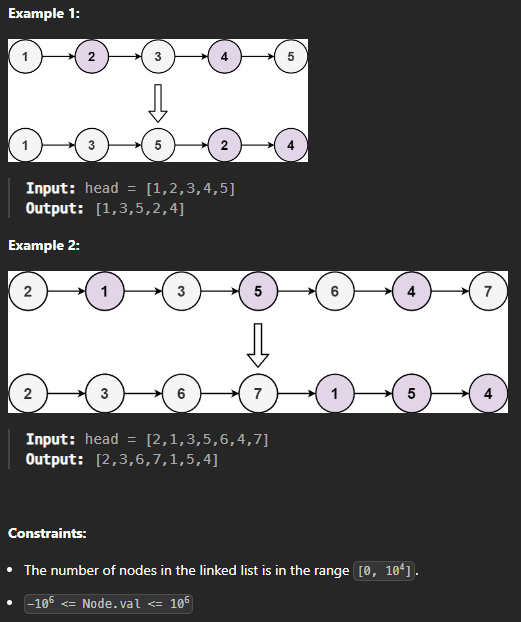
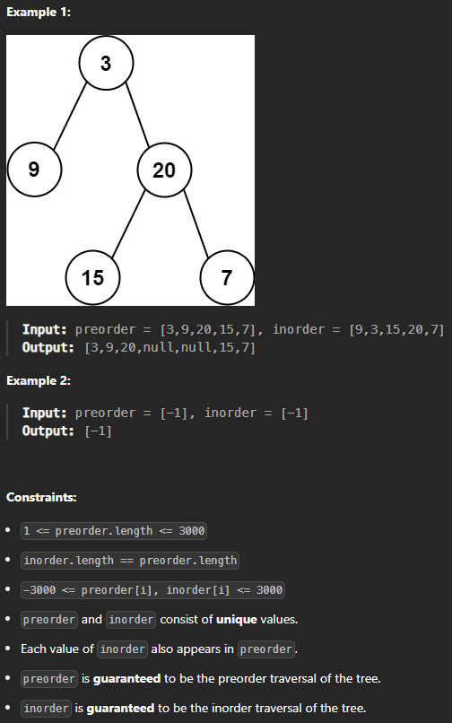
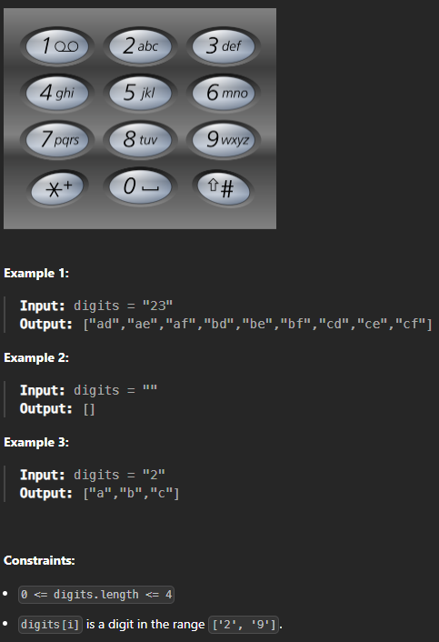
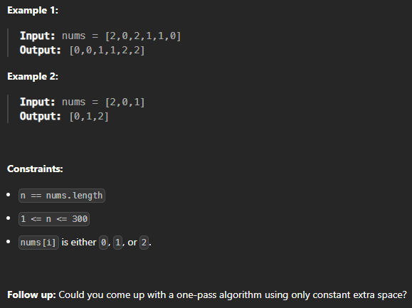
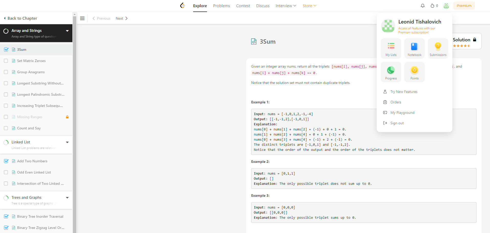

# Отработка

## Отработка ЛР1

## 3Sum

Given an integer array nums, return all the triplets [nums[i], nums[j], nums[k]] such that i != j, i != k, and j != k, and nums[i] + nums[j] + nums[k] == 0.

Notice that the solution set must not contain duplicate triplets.

### Решение

```
class Solution:
    def threeSum(self, nums: List[int]) -> List[List[int]]:
        nums.sort()
        result = []
        n = len(nums)
        
        for i in range(n):
            if i > 0 and nums[i] == nums[i - 1]:
                continue
                
            left, right = i + 1, n - 1
            while left < right:
                total = nums[i] + nums[left] + nums[right]
                
                if total == 0:
                    result.append([nums[i], nums[left], nums[right]])
                    
                    while left < right and nums[left] == nums[left + 1]:
                        left += 1
                    while left < right and nums[right] == nums[right - 1]:
                        right -= 1
                        
                    left += 1
                    right -= 1
                elif total < 0:
                    left += 1
                else:
                    right -= 1
        
        return result
```

## Add Two Numbers
You are given two non-empty linked lists representing two non-negative integers. The digits are stored in reverse order, and each of their nodes contains a single digit. Add the two numbers and return the sum as a linked list.

You may assume the two numbers do not contain any leading zero, except the number 0 itself.


### Решение
```
# Definition for singly-linked list.
# class ListNode:
#     def __init__(self, val=0, next=None):
#         self.val = val
#         self.next = next
class Solution:
    def addTwoNumbers(self, l1: ListNode, l2: ListNode) -> ListNode:
        dummy_head = ListNode(0)
        current = dummy_head
        carry = 0
        
        while l1 or l2 or carry:
            val1 = l1.val if l1 else 0
            val2 = l2.val if l2 else 0
            
            total_sum = val1 + val2 + carry
            carry = total_sum // 10 
            new_digit = total_sum % 10
            
            current.next = ListNode(new_digit)
            current = current.next
            
            if l1:
                l1 = l1.next
            if l2:
                l2 = l2.next
        
        return dummy_head.next
```
## Binary Tree Inorder Traversal
Given the root of a binary tree, return the inorder traversal of its nodes' values.


### Решение
```
# Definition for a binary tree node.
# class TreeNode:
#     def __init__(self, val=0, left=None, right=None):
#         self.val = val
#         self.left = left
#         self.right = right

from typing import Optional, List

class Solution:
    def inorderTraversal(self, root: Optional[TreeNode]) -> List[int]:
        result = []
        self._inorder_helper(root, result)
        return result
    
    def _inorder_helper(self, node: Optional[TreeNode], result: List[int]):
        if node:
            self._inorder_helper(node.left, result)
            result.append(node.val) 
            self._inorder_helper(node.right, result) 
```

## Binary Tree Zigzag Level Order Traversal
Given the root of a binary tree, return the zigzag level order traversal of its nodes' values. (i.e., from left to right, then right to left for the next level and alternate between).

### Решение
```
# Definition for a binary tree node.
# class TreeNode:
#     def __init__(self, val=0, left=None, right=None):
#         self.val = val
#         self.left = left
#         self.right = right

from typing import Optional, List
from collections import deque

class Solution:
    def zigzagLevelOrder(self, root: Optional[TreeNode]) -> List[List[int]]:
        if not root:
            return []
        
        results = []
        queue = deque([root])
        left_to_right = True
        
        while queue:
            level_size = len(queue)
            level = deque()
            
            for _ in range(level_size):
                node = queue.popleft()
                
                if left_to_right:
                    level.append(node.val)
                else:
                    level.appendleft(node.val)
                
                if node.left:
                    queue.append(node.left)
                if node.right:
                    queue.append(node.right)
            
            results.append(list(level))
            left_to_right = not left_to_right
        
        return results
```

## Отработка ЛР2

## Set Matrix Zeroes

Given an m x n integer matrix matrix, if an element is 0, set its entire row and column to 0's.

You must do it in place.


## Решение

```
from typing import List

class Solution:
    def setZeroes(self, matrix: List[List[int]]) -> None:
        """
        Do not return anything, modify matrix in-place instead.
        """
        if not matrix:
            return
        
        rows, cols = len(matrix), len(matrix[0])
        first_row_has_zero = False
        first_col_has_zero = False
        
        for j in range(cols):
            if matrix[0][j] == 0:
                first_row_has_zero = True
                break
        
        for i in range(rows):
            if matrix[i][0] == 0:
                first_col_has_zero = True
                break
        
        for i in range(1, rows):
            for j in range(1, cols):
                if matrix[i][j] == 0:
                    matrix[i][0] = 0
                    matrix[0][j] = 0
        
        for i in range(1, rows):
            for j in range(1, cols):
                if matrix[i][0] == 0 or matrix[0][j] == 0:
                    matrix[i][j] = 0
        
        if first_row_has_zero:
            for j in range(cols):
                matrix[0][j] = 0
        
        if first_col_has_zero:
            for i in range(rows):
                matrix[i][0] = 0
```

## Odd Even Linked List

Given the head of a singly linked list, group all the nodes with odd indices together followed by the nodes with even indices, and return the reordered list.

The first node is considered odd, and the second node is even, and so on.

Note that the relative order inside both the even and odd groups should remain as it was in the input.

You must solve the problem in O(1) extra space complexity and O(n) time complexity.



## Решение

```
# Definition for singly-linked list.
# class ListNode:
#     def __init__(self, val=0, next=None):
#         self.val = val
#         self.next = next
class Solution:
    def oddEvenList(self, head: ListNode) -> ListNode:
        if not head or not head.next:
            return head
        
        odd = head
        even = head.next
        even_head = even
        
        while even and even.next:
            odd.next = odd.next.next
            even.next = even.next.next
            odd = odd.next
            even = even.next
        
        odd.next = even_head
        return head
```

## Construct Binary Tree from Preorder and Inorder Traversal

Given two integer arrays preorder and inorder where preorder is the preorder traversal of a binary tree and inorder is the inorder traversal of the same tree, construct and return the binary tree.



## Решение

```
# Definition for a binary tree node.
# class TreeNode:
#     def __init__(self, val=0, left=None, right=None):
#         self.val = val
#         self.left = left
#         self.right = right
class Solution:
    def buildTree(self, preorder: List[int], inorder: List[int]) -> Optional[TreeNode]:
        if not preorder or not inorder:
            return None
        
        inorder_index_map = {value: index for index, value in enumerate(inorder)}
        
        def build_subtree(preorder_start, preorder_end, inorder_start, inorder_end):
            if preorder_start > preorder_end or inorder_start > inorder_end:
                return None
            
            root_value = preorder[preorder_start]
            root = TreeNode(root_value)
            
            inorder_root_index = inorder_index_map[root_value]
            
            left_subtree_size = inorder_root_index - inorder_start
            
            root.left = build_subtree(preorder_start + 1, preorder_start + left_subtree_size, inorder_start, inorder_root_index - 1)
     
            root.right = build_subtree(preorder_start + left_subtree_size + 1, preorder_end, inorder_root_index + 1, inorder_end)
            
            return root
    
        return build_subtree(0, len(preorder) - 1, 0, len(inorder) - 1)
```

## Letter Combinations of a Phone Number

Given a string containing digits from 2-9 inclusive, return all possible letter combinations that the number could represent. Return the answer in any order.

A mapping of digits to letters (just like on the telephone buttons) is given below. Note that 1 does not map to any letters.



## Решение

```
class Solution:
    def letterCombinations(self, digits: str) -> List[str]:
        if not digits:
            return []

        phone_map = {
            '2': 'abc', '3': 'def', '4': 'ghi', '5': 'jkl',
            '6': 'mno', '7': 'pqrs', '8': 'tuv', '9': 'wxyz'
        }
        
        result = []
        
        def backtrack(index: int, current_combination: str):
            if index == len(digits):
                result.append(current_combination)
                return
        
            current_digit = digits[index]
            for letter in phone_map[current_digit]:
                backtrack(index + 1, current_combination + letter)
     
        backtrack(0, "")
        
        return result
```

## Отработка ЛР3

## Sort Colors

Given an array nums with n objects colored red, white, or blue, sort them in-place so that objects of the same color are adjacent, with the colors in the order red, white, and blue.

We will use the integers 0, 1, and 2 to represent the color red, white, and blue, respectively.

You must solve this problem without using the library's sort function.



## Решение

```
from typing import List

class Solution:
    def sortColors(self, nums: List[int]) -> None:
        """
        Do not return anything, modify nums in-place instead.
        """
        low, mid, high = 0, 0, len(nums) - 1
        
        while mid <= high:
            if nums[mid] == 0:
                nums[low], nums[mid] = nums[mid], nums[low]
                low += 1
                mid += 1
            elif nums[mid] == 1:
                mid += 1
            else:
                nums[high], nums[mid] = nums[mid], nums[high]
                high -= 1
```

## Top K Frequent Elements

Given an integer array nums and an integer k, return the k most frequent elements. You may return the answer in any order.


## Решение

```
from typing import List
import heapq
from collections import Counter

class Solution:
    def topKFrequent(self, nums: List[int], k: int) -> List[int]:
        count = Counter(nums)
        
        heap = []
        for num, freq in count.items():
            heapq.heappush(heap, (freq, num))
            if len(heap) > k:
                heapq.heappop(heap)
        
        return [num for freq, num in heap]
```

# Выполненные задания

